# System map

One supervisor Bot, one reader subagent per course, one deterministic engine in
the middle, three routines, and exactly two places anything is ever written.
GitHub renders the Mermaid below; the Bot renders it to an image on request
(`template/MESSAGES.md`, Message 6).

```mermaid
flowchart LR
    O[("You<br/>phone / desktop")]

    subgraph ROUTINES["Routines (when)"]
        direction TB
        R1["Nightly syllabus check<br/>daily 11:00 PM"]
        R2["Weekly digest<br/>Sunday 6:00 PM"]
        R3["Safety check-in<br/>every 30 min, evening<br/>(only if opted in)"]
    end

    S["Vidya — supervisor Bot<br/>(LLM at the edge)<br/>gather → launch → review → merge → report<br/>7 skills · holds the plugins<br/>applies only what the engine approved"]

    subgraph READERS["Reader subagents — one per course<br/>cheap model · read-only · no plugins"]
        direction TB
        C1["Read course<br/>course 1"]
        C2["Read course<br/>course 2"]
        CN["Read course<br/>course N"]
    end

    subgraph SOURCES["Sources (read only)<br/>a login wall stops the reader; the owner takes over"]
        direction TB
        LMS["LMS pages via browser<br/>Brightspace · Canvas · Blackboard<br/>Moodle · Classroom · any course page"]
        API["Canvas REST API<br/>(owner's token)"]
        ICS["iCal feeds"]
        GMR["Gmail (read)<br/>'moved to Thursday'"]
    end

    RJ[/"Reading JSON<br/>one per source<br/>titles and date text verbatim<br/>status ok / empty / error"/]

    subgraph ENGINE["vidya engine — plain Python, stdlib only, 67 tests<br/>(code in the middle)"]
        direction TB
        E1["extract → normalize → resolve<br/>dates · confidence · timezone<br/>cross-source dedup"]
        E2["diff vs last night's belief<br/>destructive-write guard:<br/>failed or empty read never deletes<br/>removal needs absence on 2 reads, 2 days"]
        E3["review gate<br/>ambiguous → needs-review bucket<br/>never the calendar"]
        E4["calendar plan<br/>idempotency keys · provenance · colors"]
        E5["record → commit<br/>crash-safe two-phase write<br/>ledger · belief"]
        E6["digest · graph episodes"]
        E7["safety plan<br/>remind owner → 1 alert per contact<br/>after grace → 1 all-clear<br/>owner messages · weekly share<br/>idempotent · capped · logged"]
        E1 --> E2 --> E3 --> E4 --> E5 --> E6
    end

    ST[("~/vidya-state<br/>plain JSON<br/>config · belief · ledger<br/>missing · needs_review<br/>runs · history · safety/")]

    subgraph WRITES["The only two write paths"]
        direction TB
        GC["Google Calendar plugin<br/>create / update / delete<br/>approved ops only<br/>peacock classes · tomato deadlines"]
        GMS["Gmail (send)<br/>safety messages only, verbatim<br/>from the owner's own mailbox"]
    end

    GR["Graphiti (optional)<br/>'how many times has this<br/>prof moved a deadline'"]
    P1["Safety contacts<br/>opt-in · consented<br/>N people"]

    O -- "'I'm home' · 'tell mom…'<br/>approvals · sign-in takeover" --> S
    R1 --> S
    R2 --> S
    R3 --> S
    S -- "one job<br/>per course" --> C1
    S --> C2
    S --> CN
    C1 --> LMS
    C2 --> API
    CN --> ICS
    S -. "optional<br/>email pass" .-> GMR
    LMS --> RJ
    API --> RJ
    ICS --> RJ
    GMR --> RJ
    RJ --> E1
    E5 --- ST
    E7 --- ST
    E4 -- "approved ops" --> S
    S -- "apply exactly<br/>then record" --> GC
    E6 -.-> GR
    S -- "vidya safety plan" --> E7
    E7 -- "approved messages" --> S
    S -- "send exactly<br/>then record" --> GMS
    GMS --> P1
    S -- "one honest summary<br/>+ safety reminders" --> O

    classDef code fill:#1f2937,color:#f9fafb,stroke:#111827
    classDef llm fill:#0ea5e9,color:#082f49,stroke:#0369a1
    classDef write fill:#dc2626,color:#fff,stroke:#7f1d1d
    classDef read fill:#16a34a,color:#f0fdf4,stroke:#14532d
    class E1,E2,E3,E4,E5,E6,E7 code
    class S,C1,C2,CN llm
    class GC,GMS write
    class LMS,API,ICS,GMR read
```

## How to read it

- **Blue** is an LLM doing an edge job: the supervisor talks to you and to
  plugins; each reader subagent reads one course and writes one JSON file.
  Readers never touch the calendar or the engine's state.
- **Dark** is code. Every decision that could wipe a semester or wake a parent at
  3 AM lives here, with a test: what changed, what is ambiguous, what may be
  written, whether it was already written, who may be messaged and how often.
- **Red** is the only two places anything is written outside the Bot's own
  disk. Both take an approved list from the engine and record each call.
- **Green** is read-only. A login wall, MFA or CAPTCHA stops a reader; it
  reports `error` and the owner takes over.

## Why the shape matters

Fan-out readers make the nightly run parallel and cheap (a small model per
course). The engine makes the run safe and repeatable (idempotency keys; a crash
mid-write recovers on the next `plan`). The supervisor is the only Bot allowed to
hold plugins, and it is only allowed to apply what the engine approved. The
safety module reuses the identical pattern for the one outbound channel: the
model relays, the code decides.
